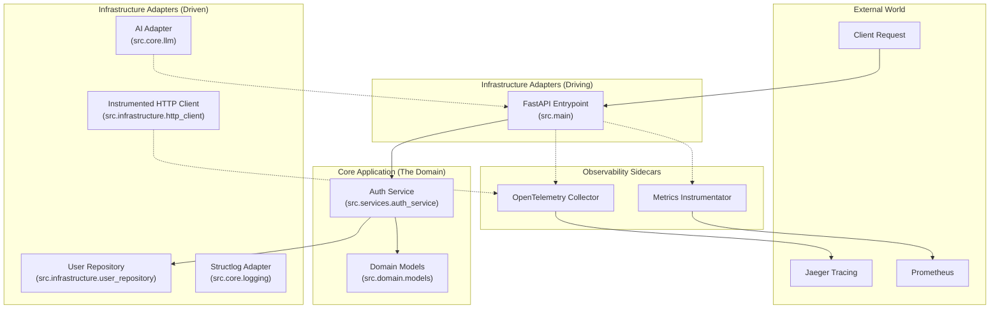

# API Reliability & Debugging Suite


[](https://daretechie.github.io/api-reliability-suite/)


[](https://github.com/sponsors/daretechie)

---

## 🏛️ Architecture: Hexagonal (Ports & Adapters)

This project follows **Hexagonal Architecture** to decouple business logic from infrastructure. This ensures the system remains testable, maintainable, and swap-able.



---

## 📂 The Codebase Explained

Features you might miss if you don't look closely:

| Path | Feature | Why it matters |
|------|---------|----------------|
| `src/core/middleware.py` | **Correlation ID** | Injects `X-Correlation-ID` into every request. Connects logs across microservices. |
| `src/core/config.py` | **Fail-Fast Settings** | Uses **Pydantic v2** to validate env vars on startup. If a key is missing, the app crashes immediately (safe) rather than failing silently later. |
| `src/infrastructure/http_client.py` | **Distributed Tracing** | An instrumented client that automatically passes trace headers to external APIs (OpenAI, Stripe, etc). |
| `src/core/circuit_breaker.py` | **Circuit Breaker** | Tracks external failures. If an API is down, it "trips" and returns cached data instantly, preventing system hang. |
| `src/core/rate_limit.py` | **Token Bucket Limiter** | Prevents abuse by limiting requests per IP. |
| `src/services/` | **Hexagonal Logic** | Business logic is pure Python. It doesn't know what "FastAPI" is, making it easy to test. |

---

## 🚀 Day 2 Operations: Monitoring & Tracing

### 1. The "WOW" Dashboard (Real-Time)
We provide a pre-built Grafana Dashboard (`infra/grafana/dashboard.json`) that tracks:
*   **SLO Tracking**: Error Budget Burn Rate.
*   **Experience**: P99 Latency (the slowest 1% of requests).
*   **Resilience**: Live Circuit Breaker status.

**How to Import:**
1. Open Grafana (`http://localhost:3030` - admin/admin).
2. **Dashboards** → **New** → **Import**.
3. Upload `infra/grafana/dashboard.json`.
4. Select **Prometheus** datasource and Load.


### 2. Distributed Tracing (Jaeger)
See the lifecycle of every request.

1. **Spin up Infrastructure**: `docker compose up -d`
2. **Generate Traffic**: `make run` and hit endpoints.
3. **View Traces**: `http://localhost:16686`

---

## 🚀 Quick Start

### Local Development
```bash
git clone https://github.com/daretechie/api-reliability-suite.git
cd api-reliability-suite

# The fast way (using Makefile)
make install
make run

# ...or manually with Poetry
poetry install
poetry run uvicorn src.main:app --reload
```

### Run with Docker
```bash
# Using Makefile
make docker-build
make docker-run

# ...or manually
docker build -t reliability-suite .
docker run -p 8000:8000 reliability-suite
```

---

## 🔍 API Endpoints

| Endpoint | Auth | Resilience | Description |
|----------|------|------------|-------------|
| `GET /health` | ❌ | ✅ Rate Limit | Health check |
| `GET /slow` | ❌ | ❌ | Simulates slow request (tracing demo) |
| `POST /login` | ❌ | ❌ | Get JWT token (demo/secret123) |
| `GET /protected` | ✅ | ❌ | Protected route (requires JWT) |
| `GET /external-api` | ❌ | ✅ **Circuit Breaker** | Demonstrates fault tolerance & fallback |
| `GET /debug/summarize-errors`| ✅ | ✅ Rate Limit | **AI analyzes logs** and returns insights 🤖 |
| `GET /metrics` | ❌ | ❌ | Prometheus metrics for Grafana 📊 |

---

## 🧠 AI-Powered Debugging
This project includes a **Self-Healing AI Agent** that reads `app.json` logs and provides actionable insights.

**How to use:**
1. Set an API key in `.env`: `GROQ_API_KEY`, `OPENAI_API_KEY`, or `GOOGLE_API_KEY`.
2. Hit the `/debug/summarize-errors` endpoint (requires auth).
3. Receive a JSON summary of root causes and fixes.

---

## 👷 Developer Tools

This project uses **Ruff** for linting and **Pre-Commit** for quality checks.

```bash
# Install git hooks (runs automatically on commit)
make install-hooks

# Run tests
make test

# Format code manually
make format
```

---

## 💖 Support This Project

If this template helps you, consider [sponsoring my work](https://github.com/sponsors/daretechie)!

## 🤝 Hire Me

Looking for a developer who understands **API reliability, security, and DevOps**?
📧 [adelekedare2012@gmail.com](mailto:adelekedare2012@gmail.com) | [LinkedIn](https://linkedin.com/in/daretechie)
