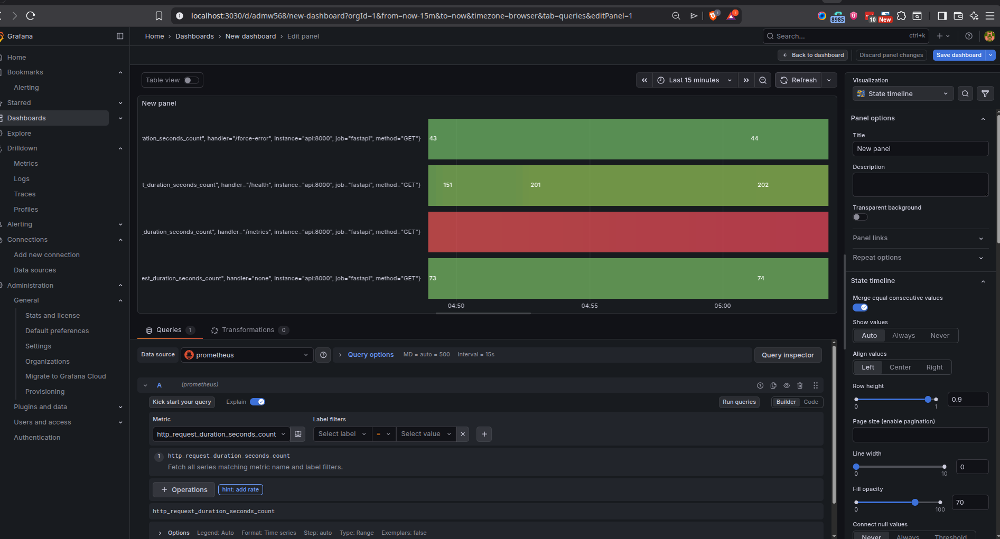

# API Reliability & Debugging Suite


[](https://github.com/sponsors/daretechie)

---

## 😤 The Problem

> **"Our API crashed at 3 AM and we have no idea why."**
>
> **"This endpoint is slow, but we can't figure out where the bottleneck is."**
>
> **"We're getting hammered by bots and can't stop them."**

Sound familiar? Most APIs are built without proper **observability**, **security**, or **testing**—making debugging a nightmare.

## ✅ The Solution

This project is a **production-ready template** that shows you how to build APIs that are:

- 🔍 **Observable** — Every request is traced, every error is logged in structured JSON
- 🤖 **Intelligent** — Uses LLMs (Groq/OpenAI) to analyze logs and suggest fixes
- 🛡️ **Secure** — Rate limiting & JWT authentication protect your resources
- ✅ **Tested** — Automated tests catch bugs before they reach production
- 🚀 **CI/CD Ready** — Push code, tests run automatically

---

## 🎯 What This Demonstrates

| Skill | Implementation |
|-------|----------------|
| **API Development** | FastAPI with async endpoints |
| **Log Analysis (AI)** | Automated error triage via LLM (Groq/OpenAI/Google) |
| **Structured Logging** | JSON logs via Structlog (ELK/Datadog ready) |
| **Distributed Tracing** | OpenTelemetry instrumentation |
| **Error Handling** | Global exception middleware |
| **Rate Limiting** | Slowapi with IP-based throttling |
| **Authentication** | JWT tokens with OAuth2 password flow |
| **Configuration** | Environment-aware settings (Pydantic) |
| **Containerization** | Multi-stage Docker build |
| **Automated Testing** | Pytest with async support |
| **CI/CD** | GitHub Actions with matrix testing |

---

## 🚀 Quick Start

### Local Development
```bash
git clone https://github.com/daretechie/api-reliability-suite.git
cd api-reliability-suite

# The fast way (using Makefile)
make install
make run

# ...or manually with Poetry
poetry install
poetry run uvicorn src.main:app --reload
```

### Run with Docker
```bash
# Using Makefile
make docker-build
make docker-run

# ...or manually
docker build -t reliability-suite .
docker run -p 8000:8000 reliability-suite
```

---

## 🔍 API Endpoints

| Endpoint | Auth | Rate Limited | Description |
|----------|------|--------------|-------------|
| `GET /health` | ❌ | ✅ 5/min | Health check |
| `GET /slow` | ❌ | ❌ | Simulates slow request (tracing demo) |
| `POST /login` | ❌ | ❌ | Get JWT token (demo/secret123) |
| `GET /protected` | ✅ | ❌ | Protected route (requires JWT) |
| `GET /debug/summarize-errors`| ✅ | ❌ | **AI analyzes logs** and returns insights 🤖 |
| `GET /metrics` | ❌ | ❌ | Prometheus metrics for Grafana 📊 |
| `GET /force-error` | ❌ | ❌ | Triggers 500 error (error handling demo) |
| `GET /docs` | ❌ | ❌ | Interactive Swagger docs |

---

## 📡 Observability & Tracing

This suite supports **OTLP (OpenTelemetry Line Protocol)** for production-grade tracing.

### Connecting to Jaeger
To see your traces in a dashboard, update your `.env`:
```env
OTLP_ENDPOINT="http://localhost:4317"
```
Then run Jaeger via Docker:
```bash
docker run -d --name jaeger \
  -e COLLECTOR_OTLP_ENABLED=true \
  -p 16686:16686 \
  -p 4317:4317 \
  jaegertracing/all-in-one:latest
```
View your traces at `http://localhost:16686`.

### 📊 Metrics & Grafana

The app automatically exposes **RED metrics** (Rate, Errors, Duration) at `/metrics`.

Spin up the full observability stack with:
```bash
docker compose up -d --build
```

| Service | URL | Login |
|---------|-----|-------|
| **API** | `http://localhost:8000` | — |
| **Prometheus** | `http://localhost:9099` | — |
| **Grafana** | `http://localhost:3030` | admin / admin |

**First-Time Grafana Setup:**
1. Open Grafana → Connections → Data Sources → Add Prometheus.
2. Set URL to `http://prometheus:9090` (internal Docker DNS).
3. Save & Test → Create your first dashboard!



---

## 🧠 AI-Powered Debugging
This project includes a **Self-Healing AI Agent** that reads `app.json` logs and provides actionable insights.

**How to use:**
1. Set an API key in `.env`: `GROQ_API_KEY`, `OPENAI_API_KEY`, or `GOOGLE_API_KEY`.
2. Hit the `/debug/summarize-errors` endpoint (requires auth).
3. Receive a JSON summary of root causes and fixes.

---

## 🏗️ Architecture Highlight: Hybrid Logging

Why do we log to both Console and File?

1.  **Console (`stdout`)**: Follows **12-Factor App** principles. Allows Docker/K8s/Datadog to capture logs without config.
2.  **File (`app.json`)**: Allows the **AI Agent** (running inside the app) to read its own history and perform self-diagnosis.

This "Loopback" architecture enables the application to **debug itself** without external dependencies.

---

## 🧩 Technical Design & Patterns

This project implements several advanced patterns that are often overlooked:

### 1. Vendor-Agnostic AI Adapter
The system doesn't rely on a single AI provider. `src/core/llm.py` automatically detects which API keys are present (Groq, OpenAI, or Google) and dynamically selects the best available provider. This prevents vendor lock-in.

### 2. Hermetic Testing
Tests (`tests/conftest.py`) are designed to run in complete isolation. We mock the OpenTelemetry exporters so that running `make test` doesn't require a running Jaeger instance or Docker container. The tests verify the *logic*, not the infrastructure.

### 3. Fail-Safe Configuration
Using Pydantic Settings (`src/core/config.py`), the application enforces strict type validation on startup. If a required environment variable is missing, the app crashes immediately (Fail Fast) rather than failing silently at runtime.

---

## 👷 Developer Tools

This project uses **Ruff** for linting and **Pre-Commit** for quality checks.

```bash
# Install git hooks (runs automatically on commit)
make install-hooks

# Run tests
make test

# Format code manually
make format
```

---

## 💖 Support This Project

If this template helps you, consider [sponsoring my work](https://github.com/sponsors/daretechie)!

## 🤝 Hire Me

Looking for a developer who understands **API reliability, security, and DevOps**?
📧 [adelekedare2012@gmail.com](mailto:adelekedare2012@gmail.com) | [LinkedIn](https://linkedin.com/in/daretechie)
