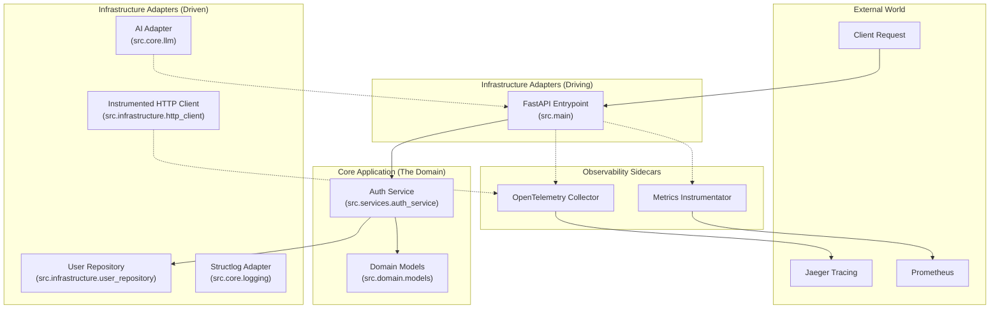

# Architecture & Internals

This project uses a service-oriented layout with **ports-and-adapters-inspired seams**. Some boundaries are formalized through abstractions such as `BaseLLM`, while others are still concrete implementations that can be refactored further as the template matures.

---

## 📐 System Diagram

---

## 🛠️ The Codebase Explained

| Path | Feature | Why it matters |
| :--- | :--- | :--- |
| `src/core/middleware.py` | **Correlation ID** | Injects a unique `X-Correlation-ID` into every request for distributed tracing. |
| `src/core/config.py` | **Fail-Fast Settings** | Uses Pydantic v2 strict mode to validate environment variables on startup. |
| `src/core/circuit_breaker.py` | **Fault Tolerance** | Implementation of the Circuit Breaker pattern with state management (Open, Closed, Half-Open). |
| `src/core/rate_limit.py` | **Fixed-Window Rate Limiting** | SlowAPI + limits with configurable storage backend. |
| `src/services/` | **Service Layer** | Business logic orchestration that stays separate from request handling. |
| `src/domain/models.py` | **Data Integrity** | Pydantic models ensuring "Garbage In" never reaches our core logic. |

---

## ⚡ Resilience Implementation

### Circuit Breakers
Our implementation tracks consecutive failures.
- **Trip Condition**: 5 consecutive failures.
- **Cooldown**: 60 seconds.
- **Metric**: Each state change is exported as a Prometheus metric for real-time monitoring.

### Trace Propagation
We provide an **instrumented HTTP client** in `src.infrastructure.http_client` that propagates trace context and correlation IDs for outbound calls.

!!! info "ADRs"
    For high-level design rationale, refer to the [Decision Log (ADRs)](adr/0001-hexagonal-architecture.md).
