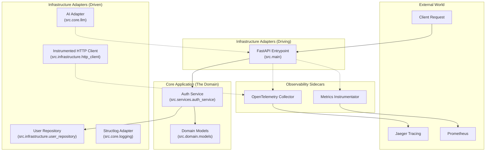

# Architecture & Internals

This project follows **Hexagonal Architecture** (also known as Ports & Adapters) to ensure the system remains testable, maintainable, and decoupled from frameworks.

## System Diagram

## The Codebase Explained

A breakdown of the critical modules that provide reliability.

| Path | Feature | Why it matters |
|------|---------|----------------|
| `src/core/middleware.py` | **Correlation ID** | Injects a unique `X-Correlation-ID` into every request. This ID is propagated to logs and external services, allowing you to stitch together the entire story of a single request. |
| `src/core/config.py` | **Fail-Fast Settings** | Uses **Pydantic v2** strict mode to validate environment variables on startup. If a required key is missing, the application crashes immediately (safe) rather than failing efficiently at runtime. |
| `src/services/` | **Hexagonal Services** | The business logic lives here. It relies only on domain models and is completely unaware of HTTP, FastAPI, or JSON. This makes it trivially testable. |
| `src/domain/models.py` | **Rich Domain Models** | Uses Pydantic to ensure data integrity. "Garbage In" immediately results in a validation error, never "Garbage Out". |
