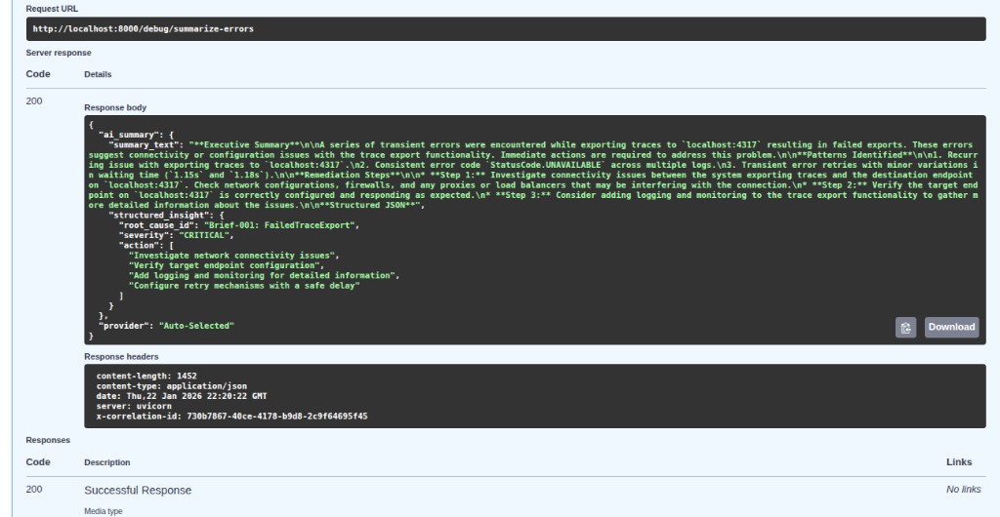

# Reliability & Resilience Features

This suite demonstrates reliability patterns that help keep an API available, observable, and easier to debug under pressure.

---

## 🛡️ Circuit Breaker Demo
The **Circuit Breaker** pattern protects your system from cascading failures when external services (like databases or third-party APIs) go offline.

- **Fast Failure**: Instead of waiting for a slow timeout, the system quickly stops hammering a failing dependency.
- **Auto-Recovery**: After a cooldown period, the system automatically checks if the service is back online.
- **Cache-Backed Fallback**: When `CIRCUIT_BREAKER_CACHE_URL` is configured, the demo endpoint returns the most recent successful upstream payload from Redis while the breaker is open.

!!! info "Implementation"
    See [Architecture & Internals](architecture.md#circuit-breakers) for the technical breakdown.

---

## 🚦 Traffic Control: Rate Limiting
To prevent abuse and ensure fair usage, we implement a **fixed-window** rate limiter via SlowAPI.

- **Login Protection**: Hardened against brute-force attacks.
- **Global Limits**: Prevents single users from exhausting server resources.
- **Storage**: `RATE_LIMIT_STORAGE_URI` controls the backend (Redis recommended for shared deployments).

!!! tip "Customization"
    Rate limits are environment-configurable via the `.env` file.

---

## 🤖 AI-Powered Triage
When an error occurs, the **AI summarizer** can analyze your logs to provide human-readable insights.

- **Summarization**: Groups error patterns and surfaces likely causes based on log content.
- **Actionable Hints**: Offers suggested next steps from the LLM output.
- **RBAC Guardrail**: `/debug/summarize-errors` is restricted to authenticated admin users.

!!! abstract "CLI Tool"
    You can trigger this analysis directly from your terminal using `make debug`.

---

## 📉 SLO Reporting

The suite exposes `/slo/report` for lightweight SLO reporting. It always returns the configured targets and, when `PROMETHEUS_BASE_URL` is set, also queries the current recording-rule values for:

- request rate
- 5-minute error ratio
- 5-minute p99 latency
- 5-minute error-budget burn rate
