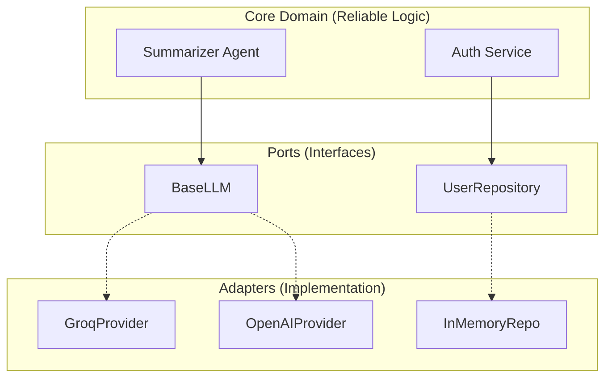

# Strategic Architecture: Reliability-Oriented Design Notes

This document explains the main design ideas behind the API Reliability Suite. It focuses on how the current template is structured today, and where its reliability claims are intentionally demo-level.

## 1. Service Layer + Adapter Seams

We decouple the **Business Logic** (Core) from the **External World** (Infrastructure).

### Why it helps:
- **Testability:** Services and helpers can be exercised without booting the whole observability stack.
- **Provider Switching:** Moving between supported LLM providers is mostly a configuration concern.
- **Refactor Path:** As the project grows, more concrete dependencies can be turned into explicit ports or protocols.

## 2. The Reliability Sidecar Pattern

Observability is not an afterthought; it's a **First-Class Citizen**.

### Key Components:
- **Distributed Tracing (OpenTelemetry):** Requests carry a `correlation_id`, and traces can be inspected in Jaeger when the observability stack is running.
- **Circuit Breaker (PyBreaker):** When the demo upstream keeps failing, the breaker opens and the endpoint returns a degraded fallback response instead of repeatedly retrying.
- **AI Log Triage:** When an error occurs, the summarizer can provide a first-pass explanation and remediation hints from local logs.

---
